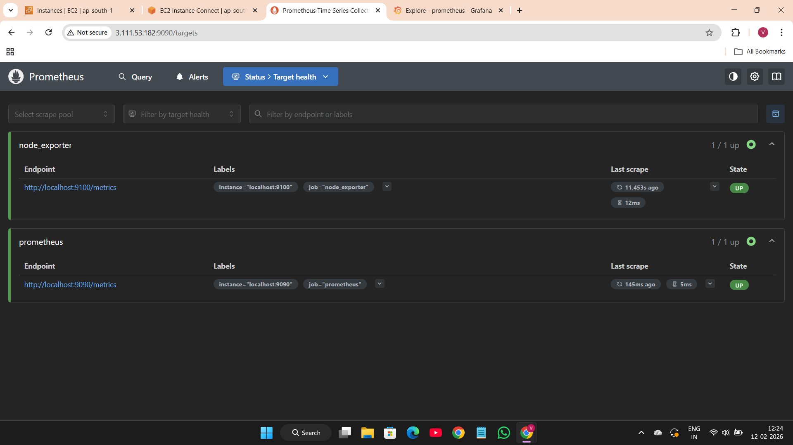
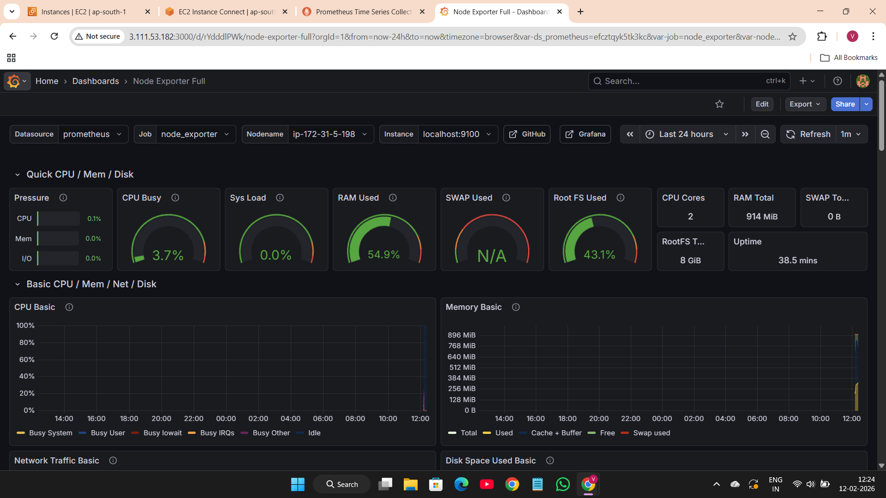

# 📊 AWS Monitoring Stack using Prometheus & Grafana

## 🚀 Project Overview

This project demonstrates a production-style monitoring setup on AWS EC2 using Prometheus and Node Exporter, integrated with Grafana dashboards for real-time infrastructure visibility.

The stack monitors CPU, memory, disk, and network metrics from a live EC2 instance.

---

## 🏗 Architecture

EC2 Instance  
→ Node Exporter (collects system metrics)  
→ Prometheus (scrapes & stores metrics)  
→ Grafana (visualizes dashboards)

---

## 🛠 Tech Stack

- AWS EC2 (Ubuntu)
- Prometheus
- Node Exporter
- Grafana
- Linux (systemd)
- YAML Configuration

---

## ⚙️ Implementation Steps

1. Launched Ubuntu EC2 instance on AWS
2. Installed Node Exporter and configured it as a systemd service
3. Installed Prometheus and configured scrape targets
4. Validated metrics using Prometheus `/targets`
5. Installed Grafana and connected Prometheus as data source
6. Imported Node Exporter Full Dashboard (ID: 1860)

---

## 📁 Project Structure

aws-monitoring-stack-prometheus-grafana/
│
├── README.md
├── prometheus/
│ └── prometheus.yml
├── systemd/
│ ├── prometheus.service
│ └── node_exporter.service
└── screenshots/
├── prometheus-targets.png
└── grafana-dashboard.png

---

## 📈 Features

- Real-time system monitoring
- CPU, memory, disk & network tracking
- Prometheus scrape configuration
- systemd-based service management
- Production-style troubleshooting & debugging

---

## 📸 Screenshots

### Prometheus Targets

### Grafana Dashboard

---

## 🧠 Key Learnings

- YAML configuration debugging
- Service management using systemctl
- Port & connectivity troubleshooting
- Monitoring architecture design
- Infrastructure observability fundamentals

---
